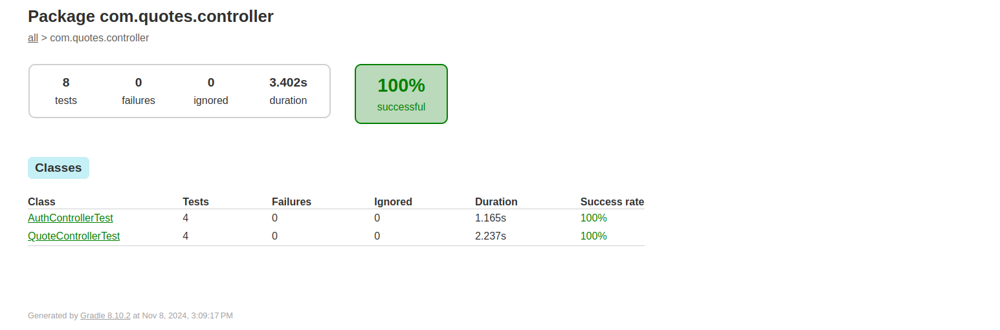

# Quotes Api

This project is a Spring Boot application managed with Gradle. It supports three profiles: `dev`, `test`, and `docker`. Below are the instructions for running the application in different environments.

## Prerequisites

Make sure you have the following installed:

- [JDK 17+](https://adoptopenjdk.net/) or higher
- [Gradle](https://gradle.org/install/) 8 or higher
- [Spring Boot 3.3.5](https://adoptopenjdk.net/) or higher
- [Docker](https://www.docker.com/get-started) 
- [Docker Compose](https://docs.docker.com/compose/install/) 


This application uses different databases depending on the active profile:

- **`dev` and `docker` Profiles**: PostgreSQL is used as the primary database for these environments.
- **`test` Profile**: For integration tests, the application uses an embedded H2 database. This allows for a lightweight, in-memory database solution that simplifies testing and requires no additional setup.


## Running the Application

### 1. Run in Development Profile (`dev`)

To run the application in the `dev` profile, execute the following command:

```bash
gradle bootRun -Dspring.profiles.active=dev
```

### 2. Run Tests (`test`)

To run tests with the test profile, execute:
```bash
gradle test -Dspring.profiles.active=test
```

### 3. Build Docker Image

Before running the application in a Docker container, you need to build the Docker image. To do this, run:
```bash
gradle bootBuildImage --imageName=quotes-api-01 -Dspring.profiles.active=docker
```

This will build a Docker image named quotes-api-01. Make sure Docker is running on your machine before executing this command.

### 4. Run the Application with Docker  

To run the application in a Docker container, you can use Docker Compose. The docker-compose.yml file is included in the root directory of the project. This file defines the Docker image and container settings.

To start the application using Docker Compose, run the following command:
```bash
docker-compose up
```
This will build and start the application container using the quotes-api-01 image and expose the application on port `8080`.

## Test Reports for Integration Tests

Gradle generates detailed test reports for integration tests, which can be found in the following directory:
```bash
/build/reports/tests/test/packages/com/quotes/controller.html
```



## Accessing API Documentation

After the application is running, whether in the dev profile or as a Docker container, you can access the API documentation via Swagger at the following URL:

```bash
http://localhost:8080/swagger-ui/index.html#/ 
```

